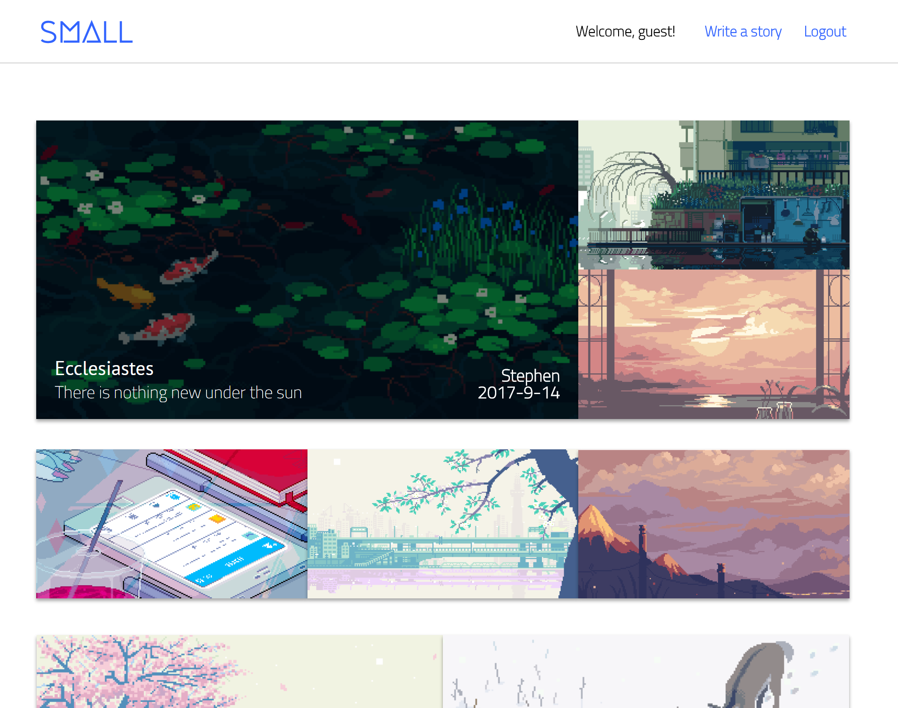
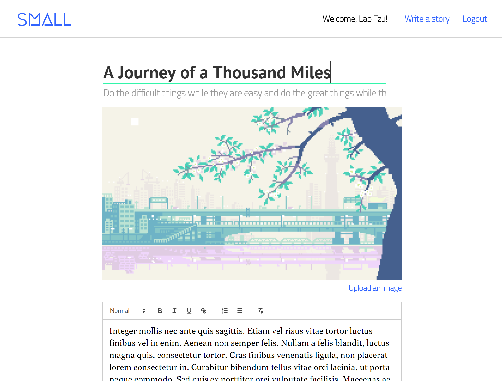
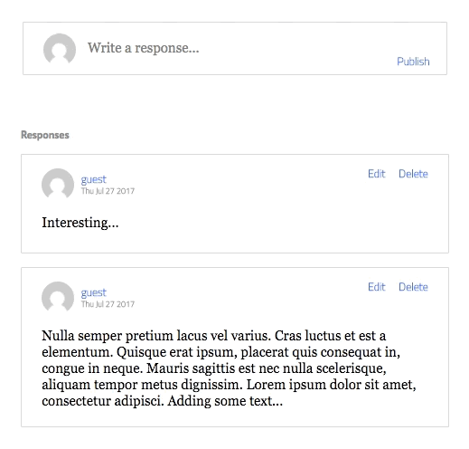

# Small

[Live Demo][heroku]

[heroku]: https://small-project.herokuapp.com/

Small is a blogging website for the little things in life, inspired by Medium. It makes use of a Rails/PostgreSQL backend with React.js and Redux on the frontend.

The project was designed and built within a two-week timeframe, though I plan to continue adding improvements over time.

## Features
  * Secure frontend to backend user authentication using BCrypt.
  * Users can create and edit stories using a Quill-enabled rich text editor.
  * Feed dynamically adapts to display all published stories in an appealing way.
  * Users can comment on posts and edit their responses directly on the page.
  * Users can like posts and follow other users.
  * Stories support images and animated GIFs.

### Adaptive Feed

The feed updates to display all stories that have been posted to the site. The size of each story tile adapts to display each row in the most appealing way possible, preventing hanging tiles or tiles that occupy a row by themselves. Many combinations are possible, including two rows of two, one row of two and another of three, and two of threes, among others.



This was accomplished by breaking the feed into grouped row components, each with differing layouts, and selecting the optimal one based on the number of remaining stories, like so:

```js
  switch(idx) {
    case (this.props.stories.length - 4):
      feedRows.push(
        <GroupOfTwo
          key={this.props.stories[idx].id}
          stories={this.props.stories.slice(idx, idx+2)} />
      )
      idx += 2;
      break;
    default:
      feedRows.push(
        <GroupOfThree
          key={this.props.stories[idx].id}
          stories={this.props.stories.slice(idx, idx+3)} />
      )
      idx += 3;
  }
```

Though a variety of potential approaches exist to this problem, this one stood out to me as both the simplest and most-readable solution, which translates to a cleaner and more maintainable codebase.

### Story editing and conditional rendering

Users can add stories with a minimum of the title and body. There is an optional description element as well as support for image uploading. Each story's show page contains additional information about the author as well as the date it was published.

The story creation and editing page is modest at first glance:



To keep code DRY, similar components were combined into a singular, more adaptable component to avoid rendering multiple copies of what was essentially the same html in different classes. This was done for the story creation and update pages as well as the login and signup dialogs. While this increases the complexity of the classes somewhat, it pays off in the newfound ease of switching form types:

```js
  setForm(formType) {
    return () => {
      this.setState({ formType }, () => {
        this.props.resetErrors();
        this.focusFirstElement();
      });
    };
  }
```

Similarly, for the login form, a single modal component can be used for all session-related tasks:

```js
  <span className="write-story"
    onClick={this.openModal('login')}>Write a story</span>

  <span className="link"
    onClick={this.openModal('login')}>Login</span>
  &nbsp;
  <span className="link"
    onClick={this.openModal('signup')}>Sign Up</span>

  <Modal
    className="modal"
    overlayClassName="modal-overlay"
    isOpen={this.state.modalIsOpen}
    onRequestClose={this.closeModal}
    contentLabel="Login Modal">

    <LoginModalContainer
      formType={this.formType} />

  </Modal>
```

And when errors inevitably appear, debugging only needs to happen in one central location as opposed to several related classes. In addition, styling only needs to happen on one component and the site as a whole is lent a better sense of coherence as a result.

### Creating and updating comments



Comments are added to the story page dynamically using React and Redux's render and subscription features, respectively. Because of this, changes in state are reflected immediately upon request completion, without any need for additional DOM manipulation.

In addition, editing comments occurs "directly" in the comment thread, with updates occurring immediately after submit. The `<textarea>` element adapts its size dynamically to fit the contents of the container.


This was accomplished through a hidden `<form>` element that is conditionally rendered with an `autofocus` property. The autofocus property triggers an `onfocus` event that acts as a pseudo-initialization for the element, which then begins to update in real-time:

```html
{ this.state.showForm ? (
  <CommentEditForm
    comment={this.props.comment}
    toggleEdit={this.toggleEdit}
    updateComment={this.props.updateComment}
    authorId={this.props.currentUser.id}
  />
) : (
  <p>{comment.body}</p>
)}
```

## Project Design

Small was designed with simplicity and elegance as its primary goals. Considering the two-week time period, it was decided to focus on a core set of features that ran smoothly and bug-free. Keeping code manageable was prioritized over cloning every major feature of the target app, in the interest of providing a solid codebase to build upon for the future.

## Technologies

Rails was chosen due to its out-of-the-box support for relational databases and RESTful architecture. As this project was a smaller-scale portfolio piece being built in a relatively short timeframe, convenience and speed was prioritized over scalability. For this reason, the chosen technologies (Heroku, Rails, etc.) were determined to be adequate for the predicted load.

Frontend Redux states are set up in a way such that there are separate reducers and actions for stories, comments, likes, follows, users, and errors. This keeps the state normalized, easing the task of keeping things up-to-date with changes in the database.

In addition to the included packages, [Cloudinary][cloudinary] was used for image uploading.

[cloudinary]: http://cloudinary.com/

### Additional Resources
  * [Proposal Wireframes][wireframes]
  * [API Endpoints][apiEndPoints]
  * [Database Schema][dbSchema]

[wireframes]: https://github.com/s-pangburn/small/wiki/Wireframes
[apiEndPoints]: https://github.com/s-pangburn/small/wiki/Routes
[dbSchema]: https://github.com/s-pangburn/small/wiki/Schema

## Possible future features

In the future I would like to add:
  * User pages/avatars
  * Search
